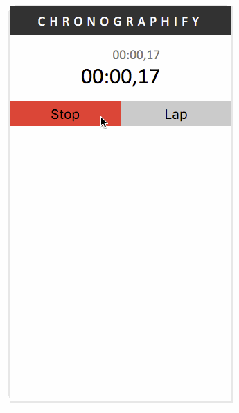

# Chronographify

Incredible time-keeping device written in Elm 0.17.

[
Try it now!](https://ohanhi.github.io/elm-chronographify)


Basically all of the code is in `Main.elm`.


Build it yourself by [installing Elm](http://elm-lang.org/install) and running:

```bash
$ elm-make Main.elm --output=elm.js
```
